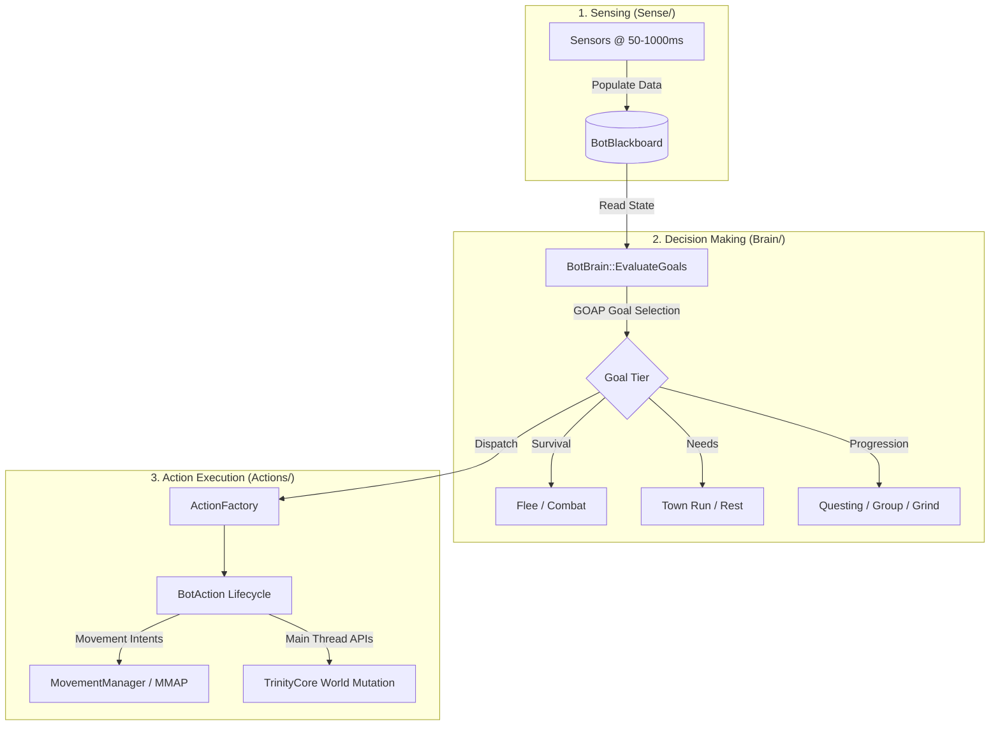

# WorldBots

[](https://en.wikipedia.org/wiki/C%2B%2B20)
[](https://github.com/TrinityCore/TrinityCore)
[](https://tswow.org/)
[](LICENSE)

**WorldBots** is an autonomous, high-performance player bot artificial intelligence module engineered for **TrinityCore (3.3.5a WotLK)** and the **TSWoW** framework.

WorldBots populates the game world with intelligent, self-sufficient bots that explore, quest, group up, engage in tactical combat, learn spells and talents, manage their inventory and equipment, and adapt dynamically to difficult encounters. Designed from the ground up for scale, stability, and high concurrency, the module sustains fleets of hundreds to thousands of concurrent bots with strict tick-rate budgets and memory safety.

---

## Key Features & Subsystems



### 1. Architectural Integrity & Threading
- **Main-Thread Mutation Rule**: All TrinityCore game world mutations occur safely on the server's main thread.
- **Decoupled Task Scheduler**: Subsystems execute on dedicated discrete schedules with subtractive timing accumulation (`elapsed -= interval`), eliminating drift during server lag.
- **Pure Data Blackboard**: `BotBlackboard` serves strictly as a decoupled data snapshot container, preventing circular logic and god-object anti-patterns.
- **Pointer Safety (`ObjectGuid`)**: Zero raw pointers stored across execution cycles; entities are looked up safely per-tick by GUID.

### 2. Autonomous Questing & World Progression
- **Comprehensive Objective Handling**: Natively handles kill objectives, item collection, dialogue turn-ins, exploration triggers, credit events, and item interaction objectives.
- **Preflight & Path Safety**: Validates ground path connectivity before committing to remote quests; automatically avoids impassable terrain, level-inappropriate zones, and danger hotspots.
- **Adaptive Fallback Grinding**: When quest progress stalls, bots dynamically transition into level-appropriate ecology hunting grounds to gain XP and break progression deadlocks.

### 3. Tactical Class Combat & Survival
- **10 WotLK Class Strategies**: Bespoke combat implementations for Warrior, Paladin, Hunter, Rogue, Priest, Death Knight, Shaman, Mage, Warlock, and Druid.
- **Dynamic Spell Progression**: Bots periodically visit class trainers, learn level-appropriate spells and ranks, and incorporate new abilities into their combat rotations.
- **Hunter Pet Management**: Automatic taming, feeding, happiness maintenance, and pet summoning/reviving.
- **Tactical Flee & Crowd Control**: Intelligent threat assessment trips survival disengagements; bots use crowd control (hamstring, frost nova, gouge, fears) to escape lethal encounters.

### 4. Bot-to-Bot Collaborative Grouping
- **Struggle-Triggered Recruitment**: Bots struggling with difficult quests (repeated deaths or consecutive flees) proactively recruit nearby bots up to a 5-player party.
- **Two-Tier Candidate Ranking**:
  - *Tier 1*: Prioritizes bots that already have the quest incomplete in their quest log.
  - *Tier 2*: Recruits eligible nearby solo bots and automatically shares the quest objective.
- **Role Synergy Scoring**: Evaluates party balance (Tanks, Healers, DPS) and level proximity during recruitment.
- **Turn-In Guard & Continuity**: Group members synchronize turn-ins so followers never abandon the leader; parties remain together for shared follow-up quest chains.

### 5. Town Planning & Logistics
- **Consolidated Town Runs**: Combines equipment repairs, surplus junk selling, quest turn-ins, and consumable purchases (food, drink, arrows) into a single optimized travel plan.
- **3D Vertically Weighted Vendor Navigation**: Prevents elevator and cliff navigation traps by heavily penalizing steep Z-axis deltas in multi-level capital cities (Thunder Bluff, Ironforge).
- **Starter Bag Equipping**: Automatically provisions and equips empty bag slots on managed bots.

### 6. Diagnostics, Telemetry & Testing
- **Non-Blocking Telemetry**: Live TSV snapshots (`worldbots-live.tsv`), append-only history logs (`worldbots-history-v5.tsv`), and structured event streams.
- **Standalone Logic Test Suite**: Pure C++ test runner (`WorldBotsLogicTests`) validating algorithms (goal evaluation, recruitment, vendor selection, travel heuristics) independently of live game servers.

---

## Directory Structure

```text
WorldBots/
├── livescripts/              # Native C++ module source code
│   ├── Actions/              # Action implementations (Combat, Grind, Quest, Town, Travel)
│   ├── Auth/                 # Account management, session creation & login policies
│   ├── Blackboard/           # Data-only BotBlackboard container
│   ├── Brain/                # Goal policy, threat assessment, quest selectors, recoveries
│   ├── Cache/                # Spatial and NPC query caches
│   ├── Combat/               # Class combat strategies & positioning
│   ├── Commands/             # In-game .bot command handlers
│   ├── Config/               # Runtime configuration parser
│   ├── Core/                 # CoreLogic manager & module lifecycle hooks
│   ├── Diagnostics/          # Logging, trace, structured events, soak digest
│   ├── Factory/              # Bot account and character creation pipelines
│   ├── Helper/               # Utility libraries (inventory, movement, spell learning)
│   ├── Party/                # Party coordination, combat assistance & recruitment
│   ├── Scheduler/            # Discrete timing task scheduler
│   ├── Sense/                # Blackboard sensor updaters
│   ├── Town/                 # Vendor selection & town planning algorithms
│   └── Travel/               # Multi-modal travel graph, transports, MMAP routing
├── config/                   # Configuration files (worldbots.conf.example)
├── docs/                     # Detailed architecture specs and lessons learned
├── tests/                    # Standalone unit & logic test suites
├── CONTRIBUTING.md           # Contribution guidelines & coding standards
├── LICENSE                   # GNU General Public License v2.0
└── README.md                 # Project documentation
```

---

## Getting Started

### Prerequisites
- **TrinityCore 3.3.5a** or **TSWoW** environment.
- C++20 compliant compiler (**MSVC 2022 v143** on Windows or **GCC 11+ / Clang 13+** on Linux).
- CMake 3.22+.

### Installation
1. Clone or place this repository into your modules directory:
   ```bash
   git clone https://github.com/your-username/WorldBots.git modules/WorldBots
   ```
2. Build the module through TSWoW or your core build pipeline:
   ```bash
   npx tswow build
   ```
3. Copy the sample configuration:
   ```bash
   cp modules/WorldBots/config/worldbots.conf.example modules/WorldBots/config/worldbots.conf
   ```
4. Start your `worldserver` process. Bots will automatically populate according to your configuration.

---

## Configuration

Settings are configured locally in `config/worldbots.conf`. Key settings include:

```ini
[worldserver]
# Enable WorldBots subsystem
WorldBots.Enable = 1

# Total number of bots to spawn and maintain
WorldBots.BotCount = 100
WorldBots.MaxBotCount = 2000

# Logging severity (important, normal, verbose)
WorldBots.Logging = important

# Diagnostics and performance telemetry
WorldBots.Diagnostics.Enable = 1
WorldBots.Diagnostics.Directory = worldbots-diagnostics
WorldBots.Diagnostics.IntervalSeconds = 60

# Progression fallback and difficulty thresholds
WorldBots.GrindFallback.Enable = 1
WorldBots.QuestMaxLevelsAboveBot = 1
WorldBots.GrindMinLevelOffset = -3
WorldBots.GrindMaxLevelOffset = 0

# Maximum distance to travel for routine vendor services (yards)
WorldBots.MaxRoutineVendorTravelDistance = 2000
```

Refer to [docs/configuration.md](docs/configuration.md) for complete setting definitions.

---

## In-Game Admin Commands

When `WorldBots.Tests.Enable = 1` is set, administrators (GM Level 3+) can use the `.bot` command suite:

| Command | Description |
|---|---|
| `.bot status` | Shows population, scheduler timing, and fleet metrics. |
| `.bot spawn <count>` | Dynamically queues additional bots for spawning. |
| `.bot kick <name>` | Despawns and logs out a specific bot. |
| `.bot trace <name> [on/off]` | Enables real-time verbose tracing for a specific bot. |
| `.bot test vendor` | Triggers a mock town planning evaluation on the target bot. |

---

## Running the Logic Tests

WorldBots includes a standalone logic test suite that verifies AI algorithms without needing a running server:

```powershell
# Compile the logic test runner
cmake --build <build-dir> --target WorldBotsLogicTests --config RelWithDebInfo

# Run tests
./RelWithDebInfo/WorldBotsLogicTests.exe
```

All test suites will execute and verify goal selection, vendor vertical weighting, progression ecology boundaries, candidate recruitment scoring, and group continuity.

---

## Documentation & Architecture References

- [Architecture Blueprint](ARCHITECTURE.md) - Subsystem breakdown, threading contracts, and lifecycle specifications.
- [WorldBots Lessons Learned](docs/worldbots_lessons_learned.md) - Deep architectural patterns, thread safety, and memory management lessons.
- [TSWoW Framework Guidelines](docs/tswow_lessons_learned.md) - Build pipelines, Livescripts vs. Datascripts rules, and TrinityCore FFI.
- [Testing Guide](docs/testing.md) - Comprehensive testing procedures and command references.
- [Configuration Reference](docs/configuration.md) - Full reference for all configuration options.

---

## Contributing & License

Contributions are welcome! Please review [CONTRIBUTING.md](CONTRIBUTING.md) before submitting Pull Requests.

WorldBots is licensed under the **GNU General Public License v2.0 (GPL-2.0)**. See [LICENSE](LICENSE) for details.
