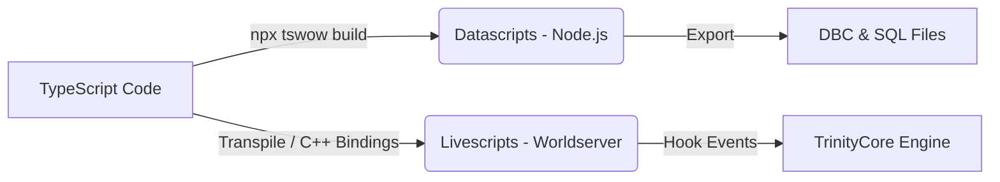

# TSWOW Lessons Learned & Technical Best Practices

This document summarizes key technical insights, gotchas, architecture rules, and lessons learned from past developments and debug sessions in the **TSWOW** (TypeScript World of Warcraft) framework.

---

## 1. Build System & Execution Environments

> [!IMPORTANT]
> **Build-Time (Datascripts) vs. Runtime (Livescripts)**
> TSWOW strictly separates code into two execution stages. Conflating these environments leads to build or runtime failures.

- **Datascripts (Build-Time Execution)**:
  - Run during `npx tswow build` / export time.
  - Used to define and modify game content (DBCs, SQL queries, Items, Spells, Creatures, GameObjects).
  - Executed inside Node.js. Cannot access TrinityCore C++ memory, active entity instances, or server runtime events.
- **Livescripts (Runtime Execution)**:
  - Run inside the active `worldserver` process (or C++ module context).
  - Can be written in TypeScript (transpiled to C++/Eluna) or native C++ modules.
  - Possess direct access to game world entities (`Player`, `Creature`, `Map`, `Spell`).
- **C++ Module Compilation & PCH**:
  - Precompiled Headers (`pch.h` / `livescripts.h`) must be preserved across module rebuilds to maintain short compile times.
  - When adding new C++ source files under `modules/<ModuleName>/livescripts/`, ensure they are added to `CMakeLists.txt` or included in the module's main entry point.
  - Submodules must be synchronized via `git submodule update --init --recursive` when cloning or updating core dependencies.
  - **Player.h & ObjectMgr.h Dependency**: In TSWoW's modified `Player.h`, the inline method `HasRunes()` directly dereferences `sObjectMgr`. Consequently, any module source or header file including `#include "Player.h"` MUST include `#include "Globals/ObjectMgr.h"` prior to `Player.h` to avoid `error C2065: 'sObjectMgr': undeclared identifier`.

---

## 2. Datascripts & Livescripts Integration

### Key Technical Rules:
1. **Template Modification via Datascripts**:
   - Always use the `std` datascript library wrappers (e.g., `std.CreatureTemplates`, `std.ItemTemplates`) rather than directly mutating raw database IDs unless writing custom migrations.
   - Always call `.set()` or export methods explicitly when customizing DBC entries.
2. **TS <-> C++ Native FFI Bindings**:
   - When exposing C++ classes to TypeScript (via `HelperBindings.h`/`.cpp` and `.d.ts`), pass raw pointers carefully and expose minimal surface area.
   - Memory ownership MUST stay on the C++ side. TypeScript wrappers must hold references or wrapper handles rather than attempting manual deletion.
3. **Runtime Event Hooks**:
   - Always check entity validity (`if (!player || !player->IsInWorld()) return;`) inside `OnWorldUpdate`, `OnPlayerLogin`, or packet hooks.

---

## 3. Database Architecture & Syncing

> [!NOTE]
> TSWOW manages three primary MySQL databases: `world`, `auth`, and `characters`.

- **Database Schemas & Migrations**:
  - Direct `ALTER TABLE` execution should be encapsulated in custom migration scripts under module datasets rather than executed manually in MySQL.
  - Custom tables used by modules (e.g., bot character persistence tables) must be initialized safely using `CREATE TABLE IF NOT EXISTS` during module startup.
- **Thread Safety in Database Operations**:
  - Never execute blocking SQL queries directly on the main server update tick.
  - Use asynchronous database callbacks (`CharacterDatabase.AsyncQuery(...)` or `WorldDatabase.AsyncQuery(...)`) for heavy data loading/saving.

---

## 4. Noggit RED MCP & World Asset Tools

> [!TIP]
> **Noggit RED MCP Tool Usage Guidelines**
> Integration with Noggit RED for WoW terrain and world building relies on coordinate transformations and tool calls.

| Operation | MCP Tool | Key Consideration |
|---|---|---|
| Terrain Height | `modify_terrain_height` | Apply localized radius smoothing to prevent sharp mesh tearing across ADT chunk boundaries. |
| Terrain Texture | `paint_terrain_texture` | Ensure texture alpha layer limits (max 4 layers per ADT chunk) are not exceeded. |
| Object Spawning | `spawn_model` | World coordinates (X, Y, Z) must be converted accurately to ADT map grid indices (0..63). |
| Custom LUA | `execute_lua` | Used for querying Noggit viewport state and selection feedback. |

- **Coordinate Mapping Gotcha**:
  - WoW World Coordinates have origin `(0, 0)` at map center, with X running North/South and Y running East/West.
  - ADT grid index math: `TileX = 32 - (X / 533.33333)`, `TileY = 32 - (Y / 533.33333)`.

---

## 5. Summary of Common Gotchas & Solutions

> [!WARNING]
> **Critical TSWOW Gotchas**

1. **Stale Asset Cache**:
   - *Problem*: Clients fail to render updated DBC/MPQ changes made by Datascripts.
   - *Fix*: Delete client `Cache/WDB` directory after rebuilding assets with `npx tswow build`.
2. **Circular Header Dependencies**:
   - *Problem*: Native C++ module compilation fails with incomplete type errors.
   - *Fix*: Use forward declarations (`class Player;`, `class Creature;`) in header files and move `#include` directives to `.cpp` files.
3. **Hot-Reloading Limits**:
   - *Problem*: Changing native C++ layout or adding virtual methods breaks running server sessions.
   - *Fix*: Binary C++ changes require a full `worldserver` restart; Livescript logic edits can be reloaded dynamically.
